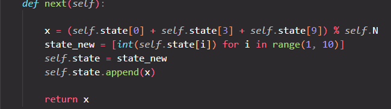

# Lagged Dimond

|   Cобытие   | Название | Категория | Сложность |
| :---------: | :------: | :-------: | :-------: |
| VKACTF 2024 | Lagged Dimond |  Crypto  |  Легкая  |

## Описание

>Автор: Inssurg3nt
>
>Преступники успели открыть даже свое онлайн [казино](https://pocker.vkactf.ru)! Сможешь ли ты поcтавить их на место?!


# Решение

Для начала разберемся в функционале сервиса. Мы можем выставить свой бэнкролл (остальные параметры бесполезны), поставтиь ставку, выбрать карты, получив другие вместо невыбранных, и узнать, какую комбинацию ты собрал. В целом, логика аналогична покеру из GTA SA.


Далее определяемся, как выбирваются карты, какой генератор исполльзуется. 
Находим, что используется генератор Фибоначчи



Смотрим, как выбираются карты, исходя из state. Замечаем схожесть с задачей китайской теоремы об остатках. Каждая карта - результат вычисления по модулю чисел state.


Далее, делая минимальные ставки - набираем пулл остатков. Модули соответственно будут равны размеру колоды, уменьшаемой на один при каждом назначении карты. Решаем систему уравнений через CRT и находим 10 значений state, их которых будут генерироваться новые колоды.


Решение представлено на языке [Python3](exploit/exploit.py).


### Флаг

```
vka{34sy_v1d3o_p0k3r_fr0m_s4n_4ndr3as}
```