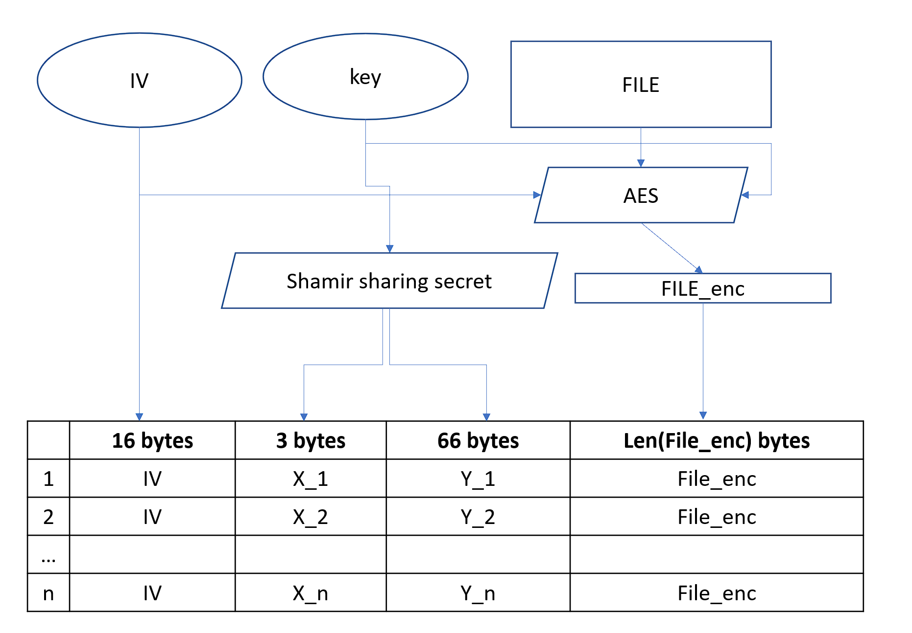
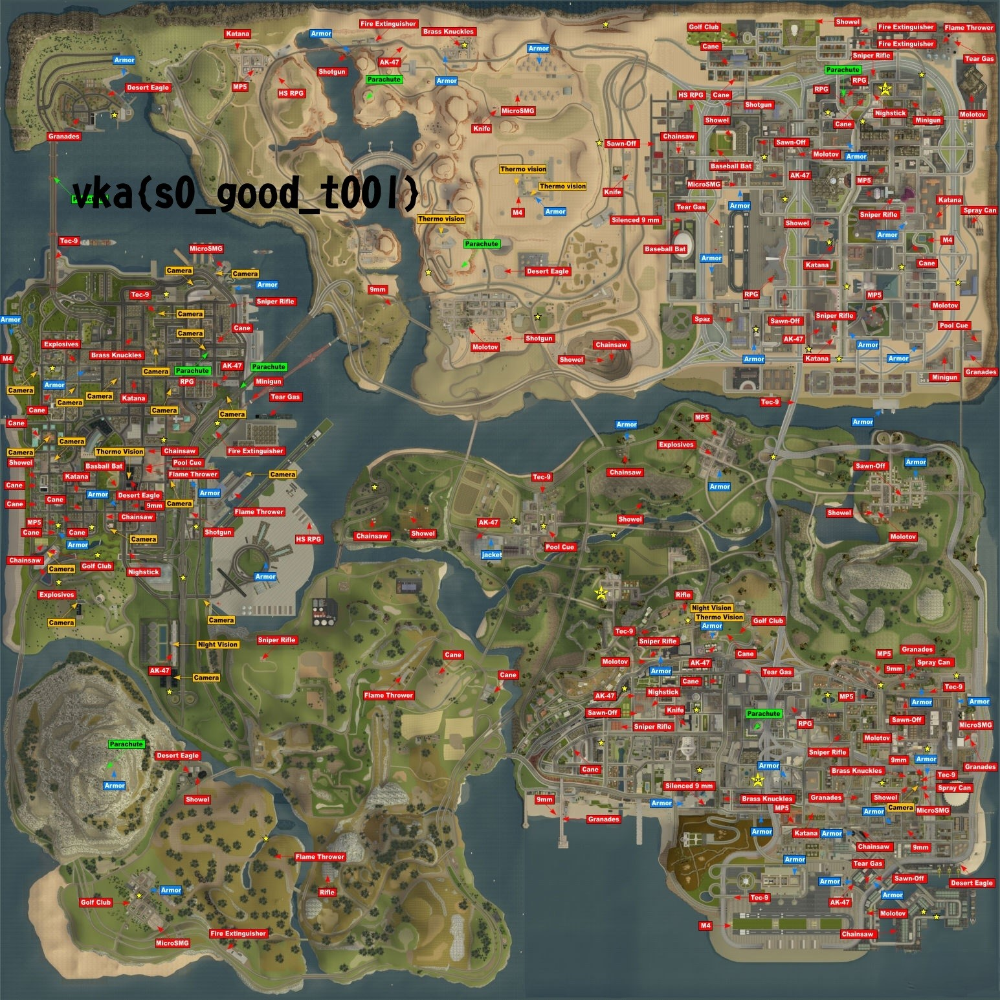

## Mapsss

|   Cобытие   | Название | Категория | Сложность |
| :---------: | :------: | :-------: | :-------: |
| VKACTF 2024 |  Mapsss  |  Crypto  |  Средняя  |

## Описание

>Автор: Inssurg3nt
>
>Беспредельщики украли копию нашей карты города-Z с метками оружия и зашифровали её... К счастью, нам удалось узнать расположение всех зашифрованных фрагментов (на карте). Более того, нам удалось получить их тулзу для шифрования, кторой мы и воспользовались для нашей карты! Теперь ходят слухи, что у них есть и другая карта, которую они зашифровали вместе с первой.

## Решение

1. Открываем архив и видим дирректорию с "украденной" тулзой и картой в формате PDF. Через ссылки на карте выкачиваем 10 файлов - зашифрованных фрагментов, но вернемся к ним позже.
2. Начинаем изучение тулзы для разделения файлов. Не сложно восстановить схему генерации частей:

3. В дирректории с тулзой обнаруживаем полноценные части зашифрованной картинки и логи, от использования тулзы. Немного изучив функционал, довольно просто восстанавливаем картинку с фейковым флагом:

4. Исходя из описания, шифровали одну и ту же картинку, при этом раздел (часть файла) с зашифрованной картинкой в файлах, выкаченных с карты, (кроме одного) аналогичен соответсвующему разделу в файлах, из которых мы восстановили картинку с фейковым флагом. Можно сделать вывод, что по схеме Шамира разделялся один и тот же ключ.
5. Изучим 10 файлов, выкаченных из карты. Можно попробовать восстановить из тех файлов картинку и убедиться, что фрагментов недостаточно, так как часть координат перетерта. Выясняем, что у одного из фрагментов (назовем его file_extra) часть с зашифрованным флагом не совпадает с остальными. При этом координата x, исходя из кода тулзы, генерируется последовательно увеличиваясь на единицу, от одного до n (параметр), а у файла file_extra параметр x совпадает с одним из остальных.
6. Итак, переводя на схему шамира, мы имеем:
> Для ивестного секрета (ключ из первого разделения) - имеем все координты X (X_1 .. X_10) и некоторые Y (Y_1, Y_2, Y_5, Y_10)
>
> Для неизвестного секрета (ключ от сектора в file_extra) - имеем координату X_2 и Y_2
7. Данные факты, при предположении об неизменных коэффицентов, надвигают на мысль об атаке [shares forgery](https://crypto.stackexchange.com/questions/54578/how-to-forge-a-shamir-secret-share)
8. Из атаки выше получаем ключ и расшифровываем картинку с флагом:


[Эксплоит](exploit/exploit.py)
### Флаг

```
vka{s3cr3t_b4nd1ts_m4p_w1th_SSS}
```