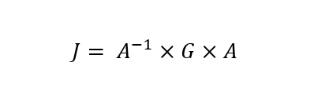
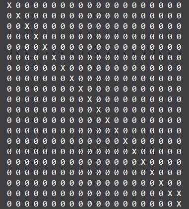
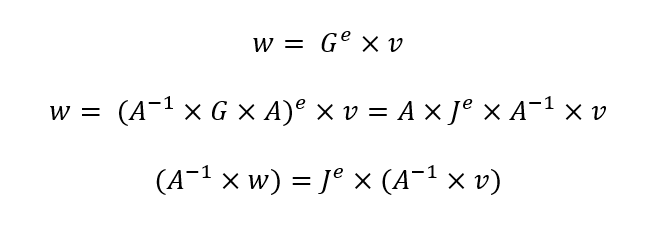
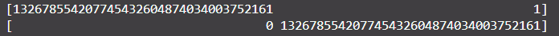

# Long Long Time

|   Cобытие   | Название | Категория | Сложность |
| :---------: | :------: | :-------: | :-------: |
| VKACTF 2024 | Long Long Time |  Crypto  |  Средняя  |

## Описание

>Автор: Inssurg3nt
>
>Один из жителей, наплевав на все ограничения, запустил этот скрипт в далеком 1987 году, когда переехал в город-Z, и вот наконец-то он отработал и выдал нам результат! Правда, он забыл добавить вывод ключа...


# Решение

Смотрим в исходники и понимаем, что рекурсия будет работать сверх долго. Делаем вывод, что output.txt немного от другого скрипта. Находим метод [быстрого вычисления ЛРП](https://neerc.ifmo.ru/wiki/index.php?title=Быстрое_вычисление_членов_линейной_рекуррентной_последовательности) и легко вычисляем pub_b:

```python
def generate_coefficient_matrix(coefficients, m):

    k = len(coefficients) - 1
    matrix = Matrix(GF(m), k, k)

    for i in range(k):
        matrix[0, i] = coefficients[i + 1]

    for i in range(1, k):
        matrix[i, i - 1] = 1

    return matrix

T = generate_coefficient_matrix([0] + c, m)
a_vec = vector(GF(m), a[::-1])
pub_b = (T ** Nb) * a_vec
print(pub_b)

```

Далее определяем, что нам нужно вычислить логарифм от S_b по основанию pub_b. Но как это сделать? Можно понять из опыта, а можно глянуть хинт, и проверить жорданову форму матрицы. 



Оказывается, она уязвима к быстрому вычислению степени, так как имеет вид:



Переводя на математический язык:



Нижние правые элементы имею вид:



Далее необходимо лишь вычислить степень и расштфровать флаг.

```python
ww = ((~A) * w)[-2:]
vv = ((~A) * v)[-2:]
g = J[-1,-1]
e = (ww[0] - vv[0]/vv[1]*ww[1])*g/ww[1]
e = int(e)
```

Решение представлено на языке [Python3](exploit/exploit.py).


### Флаг

```
vka{dh_0n_lrs_cr4ck_fr0m_j0rd4n}
```