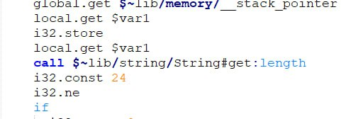
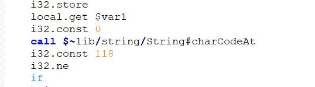
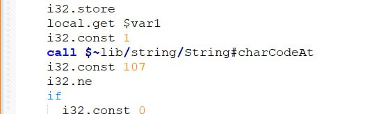

# Lottery

| Событие | Название | Категория | Сложность |
| :------ | ---- | ---- | ---- |
| VKACTF 2024 | Lottery | Reverse | Лёгкая |


### Описание


> Автор: [b3rcut7]
>
> Мы уже в их сетке! Осталось лишь ломануть одну форму!
>


### Решение
Смотрим wasm, находим функцию isMatching

Листаем дальше:



**len flag == 24**

Находим проверку по символам:




Собираем воедино: 

```python
a = [118,107,97,123,48,49,48,54,50,48,50,52,55,53,51,56,51,54,48,50,52,52,48,125]
b = ''
for i in a:
    b += chr(i)
print(b)
```

Получаем флаг!

### Флаг

```
vka{0106202475383602440}
```
