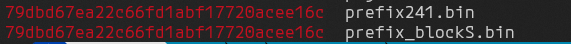

# Secret Of Criminals

|   Cобытие   | Название | Категория | Сложность |
| :---------: | :------: | :-------: | :-------: |
| VKACTF 2024 |  Secret Of Criminals  |  Reverse  |  Сложная  |

## Описание

>Автор: b3rcut7
>
>Мы на пороге раскрытия большого дела, у нас есть сайт через который общаются преступники! Осталось выйти на их главаря, а кто у нас главный специалист в этом деле? Давай, мы вот вот их поймаем!

## Решение

Unicoll:

Видим в хексах поломанный блок префикса. Гуглим: ```/==============\|  PNG IMAGE   ||     with     || MD5 collision|```
Находим https://github.com/corkami/collisions/

```python
#!/usr/bin/env python3

# a script to collide 2 PNGs via MD5
# with optimal structure and either:
# - correct CRCs with appended data
# - with synched comments and incorrect CRCs

# Ange Albertini 2018-2021

import sys
import struct

# Use case: ./png.py yes.png no.png
fn1, fn2 = sys.argv[1:3]
with open(fn1, "rb") as f:
  d1 = f.read()
with open(fn2, "rb") as f:
  d2 = f.read()

PNGSIG = b"\x89PNG\r\n\x1a\n"
assert d1.startswith(PNGSIG)
assert d2.startswith(PNGSIG)

# short coll
with open("png1.bin", "rb") as f:
  blockS = f.read()
# long coll
with open("png2.bin", "rb") as f:
  blockL = f.read()

ascii_art = b"""
vvvv
/==============\\
|  PNG IMAGE   |
|     with     |
| MD5 collision|
|    V   V     |
|     V V      |
|      V       |
|     K K      |
|     KK       |
|     K K      |
|      A       |
|     A A      |
|    AAAAA     |
|*  A     A   *|
\\==============/
""".replace(b"\n", b"").replace(b"\r",b"")

print(hex(len(ascii_art)))
assert len(ascii_art) == 0x100 - 3*4 # 1 chunk declaration + crc

# 2 CRCs, 0x100 of UniColl difference, and d2 chunks
skipLen = 0x100 - 4*2 + len(d2[8:])

###############################################################################
#
# simplest (w/ appended data and incorrect CRCs)

"""
Ca{        Ca{        Ca{
}          }           }
Cc{        Cc{         Cc{
--------   --------   --------- <== collision blocks
}a         }a          ..
  C1{        C1{         ...
}b         ..          }b
    D1         ..          D1
  }          }           .
      D2         D2          ..
""" 

from binascii import crc32
_crc32 = lambda d:(crc32(d) % 0x100000000)

suffix = struct.pack(">I", _crc32(blockS[0x4b:0xc0]))

suffix += b"".join([
  # sKIP chunk
    struct.pack(">I", skipLen),
    b"sKIP",
      # it will cover all data chunks of d2,
      # and the 0x100 buffer
  ascii_art,
  b"\xDE\xAD\xBE\xEF", # fake CRC for cOLL chunk

      d2[8:],
      # long cOLL CRC
    b"\x5E\xAF\x00\x0D", # fake CRC for sKIP chunk

    # first image chunk
    d1[8:],
    ])

with open("collision1.png", "wb") as f:
  f.write(b"".join([
    blockS,
    suffix
    ]))

with open("collision2.png", "wb") as f:
  f.write(b"".join([
    blockL,
    suffix
    ]))

###############################################################################
#
# Appended data strategy, with correct CRCs
# (make sure the aLIG chunk has valid CRCs in your prefix)

# short cOLL CRC
suffix = struct.pack(">I", _crc32(blockS[0x4b:0xC0]))

suffix += b"".join([
  struct.pack(">I", skipLen),
  b"sKIP",
  # it will cover all data chunks of d2,
  # and the 0x100 buffer
  ascii_art
])

# long cOLL CRC
suffix += struct.pack(">I", _crc32((blockL+suffix)[0x4b:0x1C0]))

suffix += d2[8:]

# CRC for jUMP after d2's IEND
suffix += struct.pack(">I", _crc32((blockS+suffix)[0xc8:0xc8 + 4 + skipLen]))

# first image chunks
suffix += d1[8:]

with open("collision-crc1.png", "wb") as f:
  f.write(b"".join([
    blockS,
    suffix
    ]))

with open("collision-crc2.png", "wb") as f:
  f.write(b"".join([
    blockL,
    suffix
    ]))


###############################################################################
#
# synched-chunks strategy (no appended data, but incorrect CRCs)

""" 
Ca{         Ca{         Ca{
}           }           }
Cc{         Cc{         Cc{
---------   ---------   --------- <== collision blocks
}a          ..          }a
  C1{         ...         C1{
}b          }b          ..
  D1          D1          ..
    C2{         C2{         ...
  }           .           }
      D2          ..          D2
      C3{         ...         C3{
    } }         } .         } }
IEND        IEND        IEND
"""

suffix2 = b"".join([
  b"CRco",

# EndA of collision

  struct.pack(">I", 0x100 + len(d1[8:-3*4])),
  b"sKIa",
    # it will cover all data chunks of d2,
    # and the 0x100 buffer
      ascii_art,
      b"^^^^",
# EndB of collision

      d1[8:-3*4],
      struct.pack(">I", 4*3 + len(d2[8:-3*4])),
      b"sKIb",
    b"crAA",
        d2[8:-3*4],
          struct.pack(">I", 0),
          b"sKIc",
      b"crBC", # for both sKIb and sKIc - hard to be correct for both

  d1[-3*4:],
])

with open("collision-sync1.png", "wb") as f:
  f.write(b"".join([
    blockS,
    suffix2
    ]))

with open("collision-sync2.png", "wb") as f:
  f.write(b"".join([
    blockL,
    suffix2
    ]))

```
png1.bin и png2.bin можем также найти на гите

Скрипт создает 2 картинки с одинаковыми хешами, одна дана вам. С помощью UniColl можем сгенерировать вторую

Суть в следующем:

У нас есть 3 блока:
1.Prefix(80байт)

2.Prefix_blockS(L) (192 байта)

3.Suffix (остальное)

Нам необходимо разбить нашу png на эти три части
```bash
dd if=collision1.png of=prefix.bin bs=1 count=80
dd if=collision1.png of=prefix_blockS.bin bs=1 count=192
dd if=collision1.png of=suffix.bin bs=1 skip=192
```

Дальше пользуемся утилитой [hashclash](https://github.com/cr-marcstevens/hashclash), запускаем там `./scripts/poc_no.sh prefix.bin`.

Он генерит нам 2 файла коллизии(1 нашей ПНГшки, другой сгенеренный). Проверяем места различия:  `cmp -l collision1.bin collision2.bin`. 

Получаем что-то похожее на:


Это значит, что у нас различия на 73 и 137 символах. 73 может быть 0 для S и 1 для L
А вот 137 надо брутить:
```python
with open('prefix_blockS.bin', 'rb') as fd:
    content = list(fd.read())  

content[73] = 1
for j in range(256):
    content[137] = j  
    with open(f'prefix{j}.bin', 'wb') as fd:
        fd.write(bytes(content)) write
```
В конце получаем кучу бинарей, проверяем хеши prefix_blockS.bin и prefix*
`md5sum prefix_blockS.bin` = **79dbd67ea22c66fd1abf17720acee16c**
`md5sum prefix* | grep 79dbd67ea22c66fd1abf17720acee16c`



теперь соединяем их:
`cat prefix241.bin suffix.bin > solve.png` и получаем почти такую же png только с разницей в 2 байта, но одинаковым хэшем

### Флаг

```
vka{w0w_y0u_cr4ck_h45h_l1k3_h45hcr4ck}
```